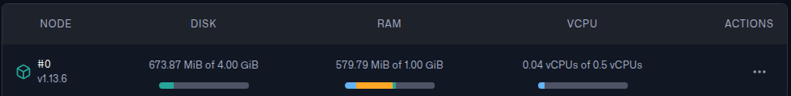

In a [previous blog](https://ahmadhamze.github.io/posts/ai/medical_chatbot/), I wrote about a RAG chatbot that I created using a dataset of medical questions and answers.

The RAG chatbot embedded the user’s question and retrieved the most relevant answers from an embedding file. Then, using the retrieved answers, GPT-4o-mini generated the final answer.

In this blog, we will get rid of the embedding file and use a vector database instead, the code will be repurposed to be smaller in size in order to deploy the chatbot using Docker and AWS.

> The code is available on [GitHub](https://github.com/AhmadHamze/Q-A-Chatbot)

### Why Vector Database?

Initially, I wanted to deploy the chatbot using the embedding file, but I realized this method is not scalable. The size of the file can get huge which means that retrieval will be slow and packaging the app will require more space.

Therefore, I decided to use a vector database instead, I chose [Qdrant](https://qdrant.tech/) among the many available options because it is easy to use and has a free tier that is sufficient for experimental purposes.

## Building the Vector Database

In this section, we will redo what we did in the previous blog, but with a twist. Not only embed the questions, but also the answers (more on that later), and instead of saving the embeddings to a file, we will save them to a Qdrant database.

> It is possible to run Qdrant locally using Docker, but I decided to use the hosted version instead.

After creating an account, you can create an API key to be able to connect to the database.

First, we need to initialize the Qdrant client

```python
from qdrant_client import QdrantClient
from google.colab import userdata

# ---- Config ----
QDRANT_HOST = userdata.get("QDRANT_HOST")
QDRANT_API_KEY = userdata.get("QDRANT_API_KEY")
COLLECTION_NAME = "ruslanmv-ai-medical-chatbot"

# ---- Initialize Qdrant Client ----
client = QdrantClient(
    url=QDRANT_HOST,
    api_key=QDRANT_API_KEY,
)
```
> Notice that the code is supposed to run on Google Colab, this is in order to use a GPU for creating embeddings.

Once the client is initialized, we can create a collection to store the embeddings. You have to specify the name and the distance metric, also the number of dimensions of the embeddings.

In our case, we will use the `cosine` distance metric and the number of dimensions is 384, this is the dimension of the [all-MiniLM-L6-v2](https://huggingface.co/sentence-transformers/all-MiniLM-L6-v2) sentence-transformer model.

```python
# ---- Create Collection ----
if not client.collection_exists(collection_name=COLLECTION_NAME):
    print("Creating collection", COLLECTION_NAME)
    client.create_collection(
        collection_name=COLLECTION_NAME,
        vectors_config=models.VectorParams(
            size=384,  # Depends on your embedding model, all-MiniLM-L6-v2 is a 384 dimensional dense vector space
            distance=models.Distance.COSINE
        )
    )
else:
    print("Collection already exists")
```

Now that we have a collection, we can load the dataset and embed the questions just like we did in the previous blog.

```python
from datasets import load_dataset
from sentence_transformers import SentenceTransformer

ds = load_dataset("ruslanmv/ai-medical-chatbot")

qa_pairs = [(entry["Patient"], entry["Doctor"]) for entry in ds["train"]]
questions, answers = zip(*qa_pairs)

# Initialize model with GPU
embed_model = SentenceTransformer("all-MiniLM-L6-v2", device="cuda")

# Process embeddings in batches
batch_size = 64  # Larger batch size for GPU
question_embeddings = embed_model.encode(
    questions,
    batch_size=batch_size,
    convert_to_numpy=True,
    show_progress_bar=True,
    device="cuda"
)
```

Now that the questions are embedded, we can insert them into the Qdrant database. However, unlike the previous blog, this time we
are trying to minimize the size of the code and the dependencies to reduce the size of the Docker image.

That's why we will save the questions and answers in the database next to the question embeddings.
This way, we can retrieve the question and the answer together without needing to load the dataset like we did in the previous blog.

To populate the database, we will make post requests to the Qdrant API, the data will be batched to avoid hitting the API limits.

To insert or update data in Qdrant, we use the `upsert` method

```python
from qdrant_client.http import models

# Upload to Qdrant

"""
'answer' is needed in the payload, otherwise, finding the context will be harder and costly.
"""

for i in tqdm(range(0, len(questions), batch_size)):
    # Batching questions 
    batch_questions = questions[i : i + batch_size]
    # Batching answers
    batch_answers = answers[i : i + batch_size]
    # Batching question embeddings
    batch_vectors = question_embeddings[i : i + batch_size]

    points_batch = [
        models.PointStruct(
            id=i+j+1,
            vector=batch_vectors[j],
            payload={"question": batch_questions[j], "answer": batch_answers[j]}
            )
        for j in range(len(batch_questions))
    ]
    client.upsert(
        collection_name=COLLECTION_NAME,
        points=points_batch,
    )
```

The `PointStruct` constructs a Qdrant `Point`, the central entity in Qdrant, it represents a single point in the vector space.

The "payload" is a dictionary that contains the metadata associated with the point, in our case, it contains the question and the answer, allowing us to retrieve them later.

> You can read more about `Points` in the [Qdrant documentation](https://qdrant.tech/documentation/concepts/points/).

This process might take a while, I remember it took around 40 minutes to finish. Also, note that after it finishes, the cluster overview page will show that the RAM and vCPU usage are off the charts, this is normal, the database needs some time to index the data.

After around 15 minutes, you should see a dashboard that looks like this (assuming you are using a dataset of the same size as the one used in the project).



Finally, we can embed a user's question and create a context using the retrieved questions and answers.

```python
def retrieve_context(query: str) -> str:
    nearest = client.query_points(
        collection_name=COLLECTION_NAME,
        query=embed_model.encode(query),
        limit=3
    )
    return "\n\n".join([
        f"Patient: {question}\nDoctor: {answer}"
        for question, answer in [
            (point.payload["question"], point.payload["answer"]) for point in nearest.points
            ]
        ])
```

The `retrieve_context` function can be used to give GPT-4o-mini the context it needs to generate the final answer, but not so fast!

#### Hugging Face Inference API

The current code needs the `sentence_transformers` library to work, all it does is load the `all-MiniLM-L6-v2` model and embed the user's question.

`sentence_transformers` is a huge library that depends on other libraries as well, installing it increases the size of the Docker image significantly.

> I created a docker image containing `sentence_transformers`, `openai`, and `datasets` libraries, the image size was around 6.1 GB!

We can avoid this easily by using the [Hugging Face Inference API](https://huggingface.co/docs/api-inference/index) to embed the user's question.

On Hugging Face, go to **Settings** > **Access Tokens** and create a new token with the `READ` permission, you can use this key to connect to the Inference API.

```python
import requests

# HUGGING_FACE_API_KEY is retrieved from the environment variables
headers = {"Authorization": f"Bearer {HUGGING_FACE_API_KEY}"}

API_URL = "https://router.huggingface.co/hf-inference/models/sentence-transformers/all-MiniLM-L6-v2/pipeline/feature-extraction"
def get_embedding(text: str):
    response = requests.post(
        API_URL,
        headers=headers,
        json={"inputs": text}
    )
    return response.json()
```

Now, instead of using the oversized `sentence_transformers`, we can simply call `get_embedding` to embed the user's question.

> Just after I finished writing this blog, the url for the `all-MiniLM-L6-v2` model changed, the app broke and even though I
> figured out quickly that the url was broken, it took me a while to find the new url.
> I had to ask a question on Hugging Face discord page, and someone pointed me to the location of the new url.
> This might be a proof that using a url might not be a good idea! You may want to use the model directly despite its size after all.

> You can call the Hugging Face API for free, but there are limitations, for a real production app, you should consider using a paid plan.

## Building the API

To use the chatbot, we need to build an API that will handle the requests and responses. We will use FastAPI with uvicorn for this purpose.

Keep in mind that the API is going to be deployed, so we need to make sure that all the needed packages are installed and that the routing is correct.

First, we need to create an `/api` folder that will contain our API code. Inside the `api` folder, we're going to have an `api_requirements.txt` file, a `/routers` folder, a `/services` folder, and a `main.py` file.

It is important to create a `__init__.py` file in each folder to make them packages, this is important for the Docker image to work correctly.

In the same directory as `main.py`, I created a `models.py` file that uses `Pydantic` to define the request and response models.
This allows FastAPI to validate the data and generate the OpenAPI documentation automatically.

```python
from pydantic import BaseModel
from typing import List, Dict, Optional

class ChatRequest(BaseModel):
    query: str
    chat_history: Optional[List[Dict[str, str]]] = []

class ChatResponse(BaseModel):
    response: str
```
We can use these types to define the post request of the API (this is defined in the `routers/chat.py` file)

```python
from fastapi import APIRouter, HTTPException
from models import ChatRequest, ChatResponse
from services.chatbot import get_chatbot_response

router = APIRouter(
    prefix="/chat",
    tags=["chat"],
    responses={404: {"description": "Not found"}},
)

@router.post("/", response_model=ChatResponse)
async def chat(request: ChatRequest):
    try:
        response = get_chatbot_response(request.query, request.chat_history)
        return ChatResponse(response=response)
    except Exception as e:
        raise HTTPException(status_code=500, detail=f"Error processing request: {str(e)}")
```

This creates a `/chat` endpoint that accepts a POST request with a JSON body containing the user's question and the chat history. The response will be a JSON object containing the generated answer.

The `get_chatbot_response` function is defined in the `services/chatbot.py` file, it's a straightforward function

```python
from qdrant_chatbot import medical_chatbot

def get_chatbot_response(query: str, chat_history=None):
    """
    Process a user query through the medical chatbot
    
    Args:
        query: The user's question
        chat_history: Optional chat history
        
    Returns:
        The chatbot's response as a string
    """
    if chat_history is None:
        chat_history = []
        
    # medical_chatbot is the function that generates the response
    response = medical_chatbot(query, chat_history)
    return response
```

#### The Chatbot

`medical_chatbot` is the function that "answers" the question, this is the same function we used in the previous blog, it takes the user's question and the chat history and returns the generated answer.

I didn't go over it in detail the last time, so let's take a look at it now

```python
def medical_chatbot(user_query, chat_history=[]):
    """Uses OpenAI's GPT-4 to generate a response with retrieved context"""
    retrieved_info = retrieve_context(user_query)
    # Used for debugging
    print("Retrieved info:", retrieved_info)
    prompt = f"""
    You are a helpful and professional medical chatbot, you only answer questions related to medical topics,
    if the user asks a question that is not medical, you should let them know that you can only answer medical questions.
    Below is past conversation data:

    {retrieved_info}

    Now, answer the following question solely based on the context provided above, do not use any other knowledge, even if it is related:
    {user_query}
    """
    response = client_4o.chat.completions.create(
        model=GPT_4o_MODEL,
        messages=[
            {
                "role": "system", "content": "You are a medical chatbot."
            },
            {
                "role": "user", "content": prompt
            }
        ],
        temperature=0.7
    )
    return response.choices[0].message.content
```

A few things to note here:

1. `retrieve_context` is the same function we defined earlier, the one retrieving the context using Qdrant and Hugging Face APIs
2. The prompt is detailed to make sure that the model doesn't answer questions that are not related to medical topics
3. The prompt tells the model to not use any other knowledge, even if it is related, this is important because otherwise, the context won't matter at all given the huge knowledge of the model

The final component of the API is the `main.py` file, this is where we define the FastAPI app and include the router.

```python
from fastapi import FastAPI
from fastapi.middleware.cors import CORSMiddleware
from routers import chat

app = FastAPI(
    title="Medical Chatbot API",
    description="API for a medical chatbot that answers health-related questions",
    version="1.0.0"
)

# CORS settings
app.add_middleware(
    CORSMiddleware,
    allow_origins=["*"],  # Adjust for production
    allow_credentials=True,
    allow_methods=["*"],
    allow_headers=["*"],
)

# Include routers
app.include_router(chat.router)

@app.get("/")
async def root():
    return {"message": "Welcome to the Medical Chatbot API. Use /docs for API documentation."}
```
The middleware is an important security feature, `allow_origins` is set to accept requests from anywhere, this is acceptable only in this case because this is a development environment. But in production, you should restrict the allowed origins to only the ones you trust.

## Conclusion and Next Steps

We rebuilt the RAG chatbot using a vector database, used Hugging Face embedding API, and built a backend API using FastAPI.

The new design is more scalable and easier to deploy, unlike the previous version, we don't need to load the dataset every time we want to retrieve the context, and we got rid of big libraries like `sentence_transformers`, `datasets`, and `faiss`.

Now, we can containerize the app and deploy it using Docker and AWS, please continue reading [here](https://ahmadhamze.github.io/posts/infra/chatbot_deployment/).
