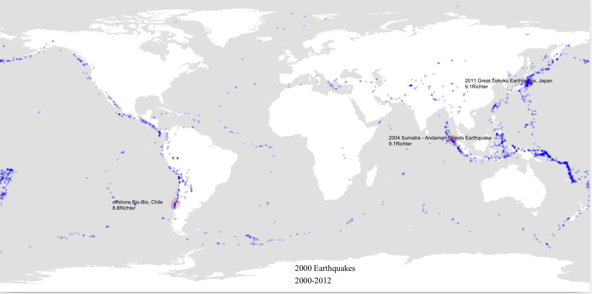

## Introduction

This is a data visualization program made using [processing.py](https://processing.org/), I made it a few years ago, however, I think it's a great program that deserves recognition.

You can find the code and the data used [here](https://github.com/AhmadHamze/Earthquakes-).

## Data

The program uses a csv file containing 2000 locations of earthquakes (longitude and latitude), the magnitude of the earthquakes, and the name of the place where they occurred (a string). Here is the source of the [data](https://earthquake.usgs.gov)


Also, an equirectangular map of the earth is needed, this is where the locations will be ploted.


## Code

We will discuss the code briefly, mainly the points that I find most interesting.

### Saving the picture on a pdf file

The output of the program will be a pdf file displaying the final image, to do that we need to use a processing library that deals with pdf files.<br>
The first line of the program calls the library: `add_library('pdf')`.

The next step is to specify the size of the image, I chose `size(1400,700)`,
then we call `beginRecord(PDF,"Earthquakes.pdf")` to save the work on a new "Earthquakes.pdf" file, and stop saving at the end of the program by calling `endRecord()`.

Just after `beginRecord`, we have to load the image we're using and create the shape of the final map.
We want the map to be drawn from the top left corner of the screen and occupy all the available width and height.
this is exactly what `shape(loadShape("WorldMap.svg"),0,0,width,height)` does.

> Note that *width* and *height* are automatic variables which are always defined as being the values entered in "size(.., ..)"

### Parsing the csv file

First, we open the csv file using a context manager `with open("EarthquakeData.csv",'r') as csv_file:`.<br>
Next, we will be making use of `csv.DictReader` to parse the csv file, this is a powerful function that returns an ordered dictionary for every line in the csv file.
The data in each line contains each data field as a value to its corresponding field name which will be a key of the dictionary.

`csv_reader = csv.DictReader(csv_file)`

Finaly, start looping `for i,li_ne in enumerate(csv_reader):`

### The map function

This is the most crucial function in the program, it's a processing function that allows translating the set of data into a map.
It takes a value that exists on one scale and maps this value on a different scale.

For example, if you want the longitude 125.5 to be mapped on a map having a certain width, this is what you need to do:

`map(125.5, -180, 180, 0, width)`

The original scale here is -180:180 with 0 as its center.

### Drawing

Back to the main code:
```python
 for i,li_ne in enumerate(csv_reader):
        graphLong = map(float(li_ne["longitude"]),-180,180,0,width)
        graphLat = map(float(li_ne["latitude"]),-90,90,height,0)
        magnitude = sqrt((float(li_ne["mag"])/2)/PI)
        if i < 3:
            fill(255,0,0,50)
            ellipse(graphLong,graphLat,20*magnitude,20*magnitude)
            fill(0)
            text(li_ne["place"] + "\n" +li_ne["mag"] + "Richter",graphLong-150,graphLat)
        else:
            fill(0,0,255,50)
            ellipse(graphLong,graphLat,5*magnitude,5*magnitude)
```
As you can see, we're using the "enumerate" function to be able to access each line of data. The first three earthquakes have a different color than the rest, also a text is displayed next to each one of the three showing the magnitude and the
name of the place where the earthquake occurred.

> *magnitude* is built in such a way that when used to draw a circle using it as a radius, you would get a disk of area magnitude / 2. This is unnecessary because the magnitude values are very small and no effect will be noticed.

## Result

Running the code will produce a pdf file containing this image.

