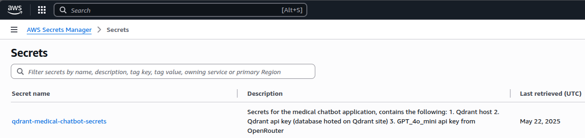
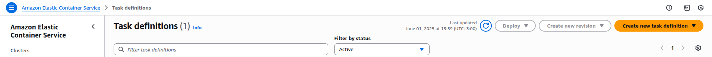

In a [previous blog](https://ahmadhamze.github.io/posts/ai/qdrant_chatbot/), we created a RAG chatbot using Qdrant, and FastAPI. In this blog, we will deploy the chatbot as an API using Docker and AWS.

## What does it mean to deploy an application?

Deployment is the process of making an application available for use, this does not necessarily mean that the application is in production.
Deployment can be done in different environments, such as development, staging, and production. In this blog, we will deploy the chatbot in a staging environment using Docker and AWS.

Staging is an environment that is similar to production, but it is not accessible to end users.
Developers and testers can use the staging environment to test the application before it gets deployed to production, this allows developers to catch any bugs or issues before they affect the end users.

## Deployment friendly code

The first step is to make sure that the code can run correctly wherever it is deployed. In our case, we have a chatbot that is using multiple API keys to connect to different services. We need to ensure that these keys are available in the environment where the code is running.

One way to do so is by using environment variables, we already have a `.env` file that contains the API keys, however, this is not the best way to store secrets in production.

### AWS Secrets Manager

In this blog, we will use AWS Secrets Manager to store the API keys and load them in the code.

Creating secrets is straightforward, just go to "AWS Secrets Manager" -> "Store a new secret", and select the type of secret you want to store.
In our case, we will use the `Other type of secrets` option, and add the keys as key-value pairs, e.g. QDRANT_HOST: `https://your-qdrant-host`, QDRANT_API_KEY: `your-qdrant-api-key`, etc.

Then, name your secret, e.g. `qdrant-medical-chatbot-secrets`, and select the encryption key (you can leave it as default).



Now that the secret is stored, we can use it in our code, to do so, we need to change the code from using the `.env` file to using the AWS Secrets Manager.

This is why we need to use the `boto3` library, this is a Python library that allows interacting with AWS services, including Secrets Manager.
We will use the `get_secret_value` method to retrieve the secret value, and then we will load it into variables.

```python
import boto3
import json

def get_secret(secret_name, region_name="eu-north-1"):
    # Create a Secrets Manager client
    session = boto3.session.Session()
    client = session.client(
        service_name="secretsmanager",
        region_name=region_name
    )
    try:
        response = client.get_secret_value(SecretId=secret_name)
        if "SecretString" in response:
            return json.loads(response["SecretString"])
        else:
            # Binary secrets handling if needed
            return json.loads(response["SecretBinary"].decode("utf-8"))
    except Exception as e:
        print(f"Error retrieving secret {secret_name}: {e}")
        raise

# Get secrets from AWS Secrets Manager
# You can store all related secrets in one secret with multiple key-value pairs
secrets = get_secret("qdrant-medical-chatbot-secrets")

GPT_4o_MODEL = "openai/gpt-4o-mini"
client_4o = OpenAI(base_url="https://openrouter.ai/api/v1", api_key=secrets["GPT_4o_API_KEY"])

QDRANT_HOST = secrets["QDRANT_HOST"]
QDRANT_API_KEY = secrets["QDRANT_API_KEY"]
HUGGING_FACE_API_KEY = secrets["HUGGING_FACE_API_KEY"]
COLLECTION_NAME = "ruslanmv-ai-medical-chatbot"
```

> Do not forget to add the `boto3` library to `api_requirements.txt` file

## Dockerizing the application

Once the code is ready to run in any environment, we can create a Docker image for it. Docker images are portable and can run on any machine that has Docker installed, this makes it easy to deploy the application in different environments.

To create a Docker image, a `Dockerfile` is needed, this file contains the instructions to build the image. In this file,
we will instruct Docker to use a Python base image, copy the code into the image, install the dependencies, and finally run the application.

```Dockerfile
FROM python:3.12-slim

WORKDIR /app

# Copy the source code
COPY ./src/api .
# Install dependencies
RUN pip install --no-cache-dir -r api_requirements.txt

# Expose the port the app will run on
EXPOSE 8000

# Command to run the application
CMD ["uvicorn", "main:app", "--host", "0.0.0.0", "--port", "8000"]
```

A few things to note here:

1. The location of the `Dockerfile` is important, I kept it at the root of the application, the `COPY` command will have to change if you move the `Dockerfile` to a different location.
2. The `WORKDIR` command sets the working directory inside the container, this is where the code will be copied to and where the application will run.
3. The `CMD` command specifies the command to run the application, here we run the FastAPI application using `uvicorn`. We also specify what file and function to run (`main:app`), this is very important to get right, otherwise the application will not start.

> In order to not copy useless files into the Docker image, you can create a `.dockerignore` file in the root of the application, similar to `.gitignore`, and add files and directories that should not be copied into the image, such as `*.pyc`, `__pycache__`, `.env`, etc.

One simple way to test the Docker image is to build it and run it locally, you can do so by using docker commands like `docker build` and `docker run`.
However, there is a much more suitable way to test the Docker image, given that we have some AWS services to use, that is using `docker compose`.

### Docker Compose

Docker Compose is a tool that allows you to define and run multi-container Docker applications. It uses a `docker-compose.yml` file to configure the application services, networks, and volumes.

We will create a file that points to the Dockerfile, and gives access to the AWS credentials needed to run the application.

```yaml
services:
  chatbot-api:
    build:
      context: .
      dockerfile: Dockerfile
    ports:
      - "8000:8000"
    # These environments are needed to test if boto3 can connect to AWS
    # and fetch the necessary secrets for the chatbot
    # You need to pass them to the local container if you want to test if the code works
    environment:
      - AWS_ACCESS_KEY_ID=${AWS_ACCESS_KEY_ID}
      - AWS_SECRET_ACCESS_KEY=${AWS_SECRET_ACCESS_KEY}
      - AWS_REGION=${AWS_REGION}
    volumes:
      - ./src/api:/app
    restart: unless-stopped
```
The `context` specifies the directory where the Dockerfile is located, here it is the root of the application.
Under `environment`, we pass the AWS credentials to the container, this is needed for the `boto3` library to connect to AWS and fetch the secrets.

> Use `aws configure` to set up your AWS credentials locally, this will create a `~/.aws/credentials` file that contains the credentials needed to access AWS services.

Now, you can run the application using `docker compose up` from the root of the application, this will build the Docker image and run the application in a container.

One of the many benifits of dokcer compose is that when you change the code in the `src/api` directory, the changes will be reflected in the container, this is because we mounted the `src/api` directory as a volume in the container.

> This does not mean that the code in the container is changed! When you want to run the container directly, you will have to rebuild the image using `docker build` command. 

Once you make sure that you can curl the API locally, you can start the process of deploying the application to AWS.

## Deploying on AWS

To deploy the application on AWS, we will use AWS ECS Fargate, which is a serverless compute engine for containers that allows running containers without managing servers or clusters.

The first step is to make the docker container available on AWS, to do so, we will push the Docker image to AWS Elastic Container Registry (ECR).

### Pushing the Docker image to AWS ECR

Go to the AWS Management Console, and navigate to the ECR service. Create a new repository for your Docker image, e.g. `ai-chatbot-medical`.
Once the repository is created, you will see instructions on how to push the Docker image to ECR.
It is a three-step process:

1. Authenticate Docker to the ECR registry
2. Tag the Docker image
3. Push the Docker image to the ECR repository

In our case, we built the docker image locally when we ran `docker compose up`, however, it is better to rebuild the image 
again to make sure the image is updated with the latest code changes.

Also, the AWS command tags the image with the `latest` tag, which is not recommended and might give you a headache later on when you want to upload a newer container.
It is better to tag the image with a version number, e.g. `v1.0.0` or a commit hash, this helps you identify the image later and it helps AWS fetch the new image when you update the application.

> It turns out that AWS might have a problem fetching the newest image if you use the same tag!

### Deploying the application on AWS ECS Fargate

Once the Docker image is pushed to ECR, we can deploy the application on ECS Fargate. This is the step that runs the application in the cloud.

#### Task Definition

Before we create the service, we need to create a "task definition". A task definition is a blueprint for your application, it specifies the Docker image to use, the resources needed, and the environment variables to set.

> It is important to get this part right, otherwise, you will get errors later when you try to run the service.
> The most important part is specifying the permissions needed for the task to run.

Here are the steps to create a task definition (this is a form like page on AWS):



1. Go to **ECS > Task definitions** and create a new task definition
2. Select the **Fargate** launch type
3. In the task definition settings, give it a name (keep a -task suffix as a best practice)
4. In **Task Execution Role**, you must give permission to the task so that it is able to run, attach `ecsTaskExecutionRole`
5. In **Task Role**, you must specify some permissions to allow ECS to interact with the Docker container, this includes `CloudWatchLogsFullAccess`,  `AmazonEC2ContainerRegistryReadOnly`, and in case you're using AWS Secrets Manager, `SecretsManagerReadWrite`. Note that you have to create the rule that will be assigned in **Task role** yourself, you can do so from IAM > Roles
6. Add a container to the task definition, give it a name, specify the Docker image and the port mappings (e.g. 8000:8000)
7. Add the secrets under **Environment > Secrets**
8. Click "Add" then "Create" to create the task definition

#### ECS Service

Here are the steps for creating the ECS service:

1. Go to ECS > Clusters and create a new cluster, select the **Networking only** option, and give it a name, (keep a -cluster suffix to avoid confusion with the service name)
2. For VPC/Subnets, select or let AWS create a new VPC
3. Inside the cluster, go to **Services > Create**, you have to configure the service:
   1. Launch type: **Fargate**
   2. Task Definition: select the task definition you created earlier
   3. Cluster: select the cluster you created earlier
   4. Service name: give it a name (keep a -service suffix to avoid confusion with the cluster name)
   5. Number of tasks: set it to 1
   6. Netowrking: select subnets and assign a security group, you have to check the box for **Auto assign public IP** if you want to access the service from the internet
   7. Load balancer: this is needed for production, you can skip it, I will cover it in a future blog
4. Click "Next" and review the settings, then click "Create Service"

#### Traffic to ports

Now, you should have a running service! Congratulations! However, if you try to access the service using the public IP address, you will not get anything, bummer!

This is because the service is not configured to allow traffic to the port 8000, you need to add a rule to the security group that allows traffic to this port.

1. Got to **EC2 > Security Groups** and find the security group that was created for the ECS service
2. Click on the security group and go to the **Inbound rules** tab
3. Click on **Edit inbound rules** and add a new rule:
   - Type: **Custom TCP**
   - Protocol: **TCP**
   - Port Range: **8000** (or other port if you specified a different one in the task definition)
   - Source: **0.0.0.0/0** (or your IP address if you want to restrict access)
4. Click **Save rules**

Now, you should be able to access the service using the public IP address of the ECS service, e.g. `http://<public-ip>:8000/`.
You can find this public-ip address in the ECS service details page, under the **Tasks** tab, click on the task ID, and you will see the public IP address in the task details.

### Curling the API

If everything is working fine, you should be able to curl the API like this:

```bash
curl -X POST "http://<public-ip>:8000/chat/" -H "Content-Type: application/json" -d "{\"query\":\"Hello doctor, I was hiking a few days ago, I felt something went into my eye, the next day, my eye is full of tears and it's barely opened. What do you recommend?\"}"
```

You should get an answer from the chatbot, if that's the case, congratulations! You have successfully deployed a RAG chatbot on AWS ECS Fargate.

#### Notes

A few things to note here:
- The service might take a few minutes to start, so be patient
- If you want to turn off the task, you have to click on **Update service** and set the number of tasks to 0, this will stop the task and you will not be charged for it. Stopping the task manually will trigger a new task to start! So, make sure to set the number of tasks to 0
- Once you stop the task, the public IP address will change when you create a new one, so you will have to update the curl command with the new IP address (this is why it is better to use a load balancer which gives a stable url to use)
- The running task is what costs the most, in my case, 9 days of constant running costed me around 15$
- The service itself is not expensive, less than a dollar a month
- The secrets manager is also cheap, I ended up paying 0.1$ a month
  

## Conclusion

In this blog, we learned how to deploy a RAG chatbot on AWS ECS Fargate using Docker. We covered the steps to make the code deployment-friendly, create a Docker image, push it to AWS ECR, and finally deploy it on ECS Fargate.

I found doing this quite hard, I couldn't do it without LLMs, I had to ask for help from multiple models and figuring stuff on my own when the LLMs were not able to help me.
This will probably be challenging for you as well if this domain is new to you, I hope this blog can help.

In the next blog, I will cover how to set up a load balancer for the service, this will allow you to access the service using a stable URL and it will also allow you to scale the service if needed.
I will be also improving the chatbot and deploying a simple UI on a different service, so stay tuned!
