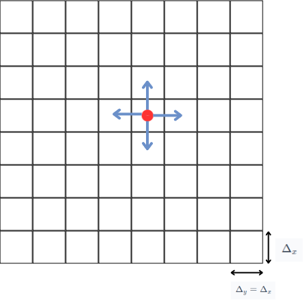

Randomness is an interesting concept, we have seen in previous blogs how it can be harnessed to compute mathematical constants, and even create a universal computer. In this blog we will see how randomness can be used to model diffusion.
Diffusion can be defined as the movement of particles from a region of higher concentration to a region of lower concentration.
This is a common phenomenon, and can be observed in our daily lives. For example, when we add sugar to a cup of tea, the sugar particles diffuse throughout the tea.
In this blog we will see how we can model diffusion using random walks.

## Mathematical model of diffusion

Let's start by defining our problem mathematically, we will use a method known as descritization to model our problem.

Our world will be a two dimensional grid, particles exist inside the grid, and can move in four directions, up, down, left and right.

We will assume that the particles cannot move outside the grid.

This picture gives us a visual representation of our model.

We track the walker (represented by the red dot) as it moves through the grid. During a time incrementation \( \Delta_t \), it has an equal chance of moving in any of the four directions (the blue arrows), or staying in its current position.

Therefore the probability of the walker moving in any direction is \( \frac{1}{5} \), and the probability of the walker staying in its current position is also \( \frac{1}{5} \).

The grid being square, we can assume that \( \Delta_x = \Delta_y \), so at each time step \( \Delta_t \), the walker may move a distance \( \Delta_x \).

 The position of a particle at a given time \( t \) is \( \left(x(t), y(t)\right) \), to find the position of the particle at time \( t + \Delta_t \), we can use the following equation:

  

  \( x(t + \Delta_t) = x(t) + \Delta_t \cdot v_x(t) \)
  

  

  \(y(t + \Delta_t) = y(t) + \Delta_t \cdot v_y(t) \)
  

This equation is basically stating that in order to find the particle's position at time \( t + \Delta_t \), we need to add the distance it has moved in the time interval \( \Delta_t \) to its position at time \( t \).

The distance the particle has moved in the time interval \( \Delta_t \) is given by \( \Delta_t \cdot v_x(t) \), where 
\( v_x(t) \) is the velocity of the particle at time \( t \) (same for \( y \)).

\(v_x, v_y \) is chosen randomly from the following set

 \( \left\{ \left(\dfrac{\Delta_x}{\Delta_t}, 0\right), \left(- \dfrac{\Delta_x}{\Delta_t}, 0\right), \left(0, 0\right), \left(0, \dfrac{\Delta_y}{\Delta_t}\right), \left(0, - \dfrac{\Delta_y}{\Delta_t}\right) \right\} \)

This covers the cases when the particle moves right, left, stay in position, up, and down respectively.

