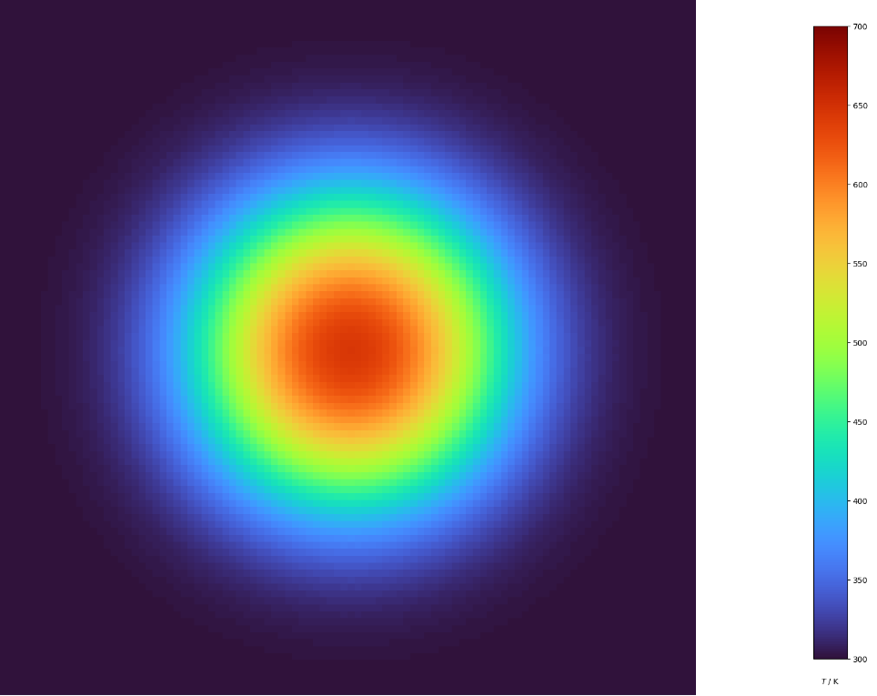
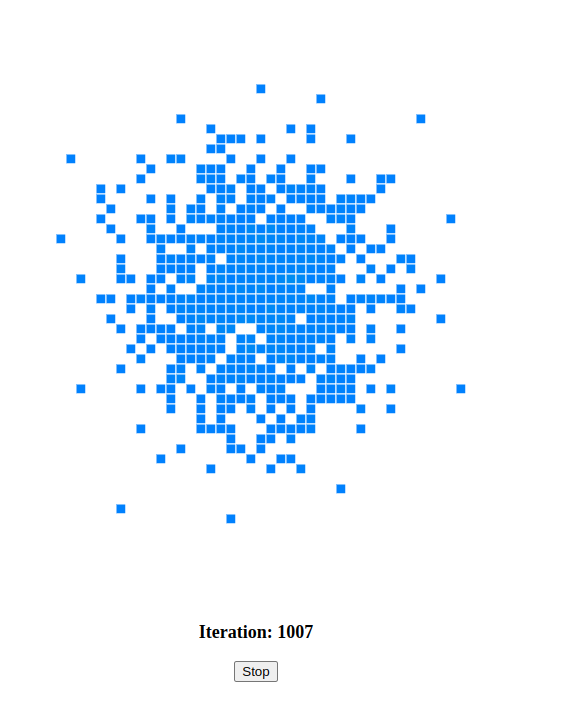
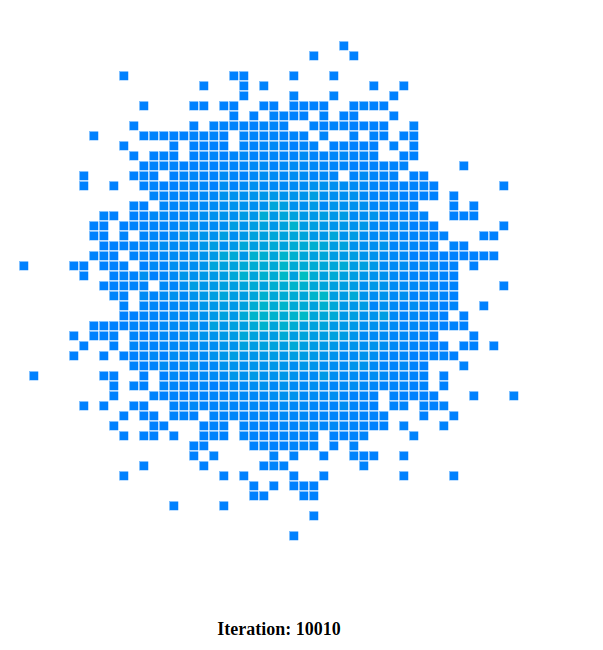

Randomness is an interesting concept, we have seen in previous blogs how it can be harnessed to [compute mathematical constants](https://ahmadhamze.github.io/posts/estimating-pi/) , and even create a [universal computer](https://ahmadhamze.github.io/posts/cellular-automata/cellular-automata/). In this blog we will see how randomness can be used to model diffusion.
Diffusion can be defined as the movement of particles from a region of higher concentration to a region of lower concentration.
This is a common phenomenon and can be observed in our daily lives. Heat transfer is a form of diffusion, when you heat a metal rod at one end, the heat will diffuse through the rod until it reaches the other end.
In this blog we will see how we can model diffusion using random walks.

## Mathematical model of diffusion

Let's start by defining our problem mathematically, we will use a method known as descritization to model our problem.

Our world will be a two dimensional grid, particles exist inside the grid and can move in four directions: up, down, left and right. We will assume that the particles cannot move outside the grid.

This picture illustrates the model.

<div align="center">

</div>

<p>
We track the walker (represented by the red dot) as it moves through the grid. During a time incrementation \( \Delta_t \), it has an equal chance of moving in any of the four directions (the blue arrows), or staying in its current position.
</p>
<p>
Therefore the probability of the walker moving in any direction is \( \frac{1}{5} \), and the probability of the walker staying in its current position is also \( \frac{1}{5} \).
</p>
<p>
The grid being square, we can assume that \( \Delta_x = \Delta_y \), so at each time step \( \Delta_t \), the walker may move a distance \( \Delta_x \).
</p>
<p>
 The position of a particle at a given time \( t \) is \( \left(x(t), y(t)\right) \), to find the position of the particle at time \( t + \Delta_t \), we can use the following equations:
</p>
<div align="center">
  <p>
  \( x(t + \Delta_t) = x(t) + \Delta_t \cdot v_x(t) \)
  </p>
  <p>
  \(y(t + \Delta_t) = y(t) + \Delta_t \cdot v_y(t) \)
  </p>
</div>
<p>
The distance the particle has moved in the time interval \( \Delta_t \) is given by \( \Delta_t \cdot v_x(t) \), where 
\( v_x(t) \) is the velocity of the particle at time \( t \) (same for \( y \)).
</p>
<p>
This equation is basically stating that in order to find the particle's position at time \( t + \Delta_t \), we need to add the distance it has moved in the time interval \( \Delta_t \) to its position at time \( t \).
</p>
<p>
\(v_x, v_y \) is chosen randomly from the following set
</p>
<p align="center">
 \( \left\{ \left(\dfrac{\Delta_x}{\Delta_t}, 0\right), \left(- \dfrac{\Delta_x}{\Delta_t}, 0\right), \left(0, 0\right), \left(0, \dfrac{\Delta_y}{\Delta_t}\right), \left(0, - \dfrac{\Delta_y}{\Delta_t}\right) \right\} \)
</p>
<p>
This covers the cases when the particle moves right, left, stay in position, up, and down respectively.
</p>
<p>
Using this model, and with some math, we can prove that on average, after some time, the position of a random walker is the same as its starting position. In addition, the average displacement of the walker is \( d = \sqrt{4 D \cdot t} \) where \( D \) is a constant called the diffusion coefficient, and \( t \) is the time.

This is equivalent to the following equation
</p>
<p align="center">
\( \partial _t \rho(x, y, t) = D(\partial^2_x + \partial^2_y)\rho(x, y, t) \)
</p>
<p>
This is the famous diffusion equation, which is a partial differential equation that describes the time evolution of a density function \( \rho(x, y, t) \).
</p>

## Solution

This is a partial differential equation, it has been the subject of many studies and a mathematical solution exists.
We will not go into the analytical solution, but here is a plot showing it.

<div align="center">

</div>

We can see a disc with different colors, at the center, the color is red signaling a higher concentration of particles, and as we move away from the center, the color changes to blue signaling a lower concentration of particles.

Think of heating a metal plate on a stove, the heat will diffuse from the center of the plate to its edges. The closer to the center, the hotter the plate will be.

## Simulation

We will now simulate the diffusion equation using the random walk model we have defined earlier.

We will start with a grid just like we did in the [cellular automata](https://ahmadhamze.github.io/posts/cellular-automata/cellular-automata/) blog. The difference here is that each cell will have a color representing the concentration of particles in that cell.

```js
class ColoredCell extends Cell {
  constructor(x, y, size, alive = 0, color = 0) {
    super(x, y, size, alive);
    this.color = color;
  }
  drawCell() {
    if (this.alive) {
      let startColor, endColor;
      if (this.color < 0.5) {
        startColor = color(0, 128, 255); // light blue
        endColor = color(0, 255, 128); // light green
      } else {
        startColor = color(0, 255, 128); // light green
        endColor = color(255, 0, 0); // red
      }
      // lerpColor is a p5 function that returns a color between two colors
      const lerpedColor = lerpColor(startColor, endColor, this.color);
      fill(lerpedColor);
      stroke(255);
      rect(this.x, this.y, this.size, this.size);
    } else {
      fill(255);
      stroke(255);
      rect(this.x, this.y, this.size, this.size);
    }
  }
}
```

The property `color` of the cell is a number between 0 and 1, the value of zero designates a white cell, i.e. a cell where the walker never stopped. The higher the value, the redder the cell, i.e. the more times the walker stopped in that cell.

### The walker

The walker is simply a position on the grid that can move in the four directions explained above or stay in the same position.
  
```js
class Walker {
  constructor(x, y) {
    this.x = x;
    this.y = y;
  }
  // This method is used for debugging
  drawWalker() {
    stroke("purple");
    fill("purple");
    ellipse(this.x, this.y, 5, 5);
  }
  move(sizeOfCell) {
    // NOTE: Picking 5 numbers, 0 to 4, one of them designates staying in the same position (i.e. do nothing)
    const direction = floor(random(5));
    switch (direction) {
      case 1:
        this.x = (this.x + sizeOfCell) % height;
        break;
      case 2:
        this.x =
          this.x > 0 ? (this.x - sizeOfCell) % height : height - sizeOfCell / 2;
        break;
      case 3:
        this.y = (this.y + sizeOfCell) % height;
        break;
      case 4:
        this.y =
          this.y > 0 ? (this.y - sizeOfCell) % height : height - sizeOfCell / 2;
        break;
      default:
        break;
    }
  }
}
```

The `move` method above is where the magic happens, we pick a random number between 0 and 4, and depending on the value of that number, we move the walker in one of the four directions or stay in the same position.

One thing remains, at the end of each time iteration, increment the color by a certain value. For this purpose the following function is created

```js
function increaseCellColor(grid, gridVSize, gridHSize, posX, posY) {
  for (let i = 0; i < gridVSize; i++) {
    for (let j = 0; j < gridHSize; j++) {
      const cell = grid[i][j];
      const distance = dist(
        posX,
        posY,
        cell.x + cell.size / 2,
        cell.y + cell.size / 2
      );
      if (distance < cell.size / 2) {
        cell.alive = 1;
        cell.color = min(cell.color + 0.01, 1);
      }
    }
  }
}
```

This function takes the grid, the size of the grid, the position of the walker, and increments the color of the cell that contains the walker by a certain value. It is called at the end of each time iteration, we will consider that the walker moves 100 times during each time iteration.

All the pieces of the code is combined inside p5.js `draw` function

```js
function draw() {
  background(51);

  for (let i = 0; i < gridVSize; i++) {
    for (let j = 0; j < gridHSize; j++) {
      grid[i][j].drawCell();
    }
  }
  const walker = new Walker(
    width / 2 + height / gridHSize / 2,
    height / 2 + height / gridHSize / 2
  );
  startButton.html("Start");
  if (running) {
    for (let i = 0; i <= 100; i++) {
      walker.move(height / gridHSize);
    }
    increaseCellColor(grid, gridVSize, gridHSize, walker.x, walker.y);
    // * You can draw the walker, useful for debugging
    // walker.drawWalker();
    iteration.html("Iteration: " + iter);
    startButton.html("Stop");
    iter++;
  }
}
```

### Result

This simulation takes some time to run, just like the Monte Carlo simulation, the more iterations you run, the better the result will be.

After one thousand iterations, this is the result

<div align="center">

</div>

We can't see much going on here, all what we see is a bunch of blue cells. Let's run the simulation for 10000 iterations.

<div align="center">

</div>

Still not much, but we can see two colors now, blue and green. Let's run the simulation for 22000 iterations.

<div align="center">

</div>

This is more like it! We can see a disc with a red center and a blue edge, green cells form a circle around the red center.

At 41000 iterations, the red disc is more defined and takes more space. we can also see different shades of red, the cells closer to the center have a stronger red color than those farther away. The green cells still form a disc around the red center.

<div align="center">

</div>

This image is quite similar to the analytical solution we have seen above.

## Conclusion

The natural phenomena of diffusion can be modeled using random walks, this is a simple model that can be implemented in not too many lines of code. The results are very similar to the analytical solution of the diffusion equation.

Why does this work? Scientists still speculate this question, when it comes to the diffusion case, there are two similar behaviors between the random walk model and the diffusion equation.

The physical particles in the diffusion equation go back to their initial position after some time, this is the same for the random walker, on average, the walker goes back to its initial position after some time.

We just saw a discrete model simulating a continuous phenomenon, this is a common theme in simulation, many real world phenomena can be modeled using discrete models.