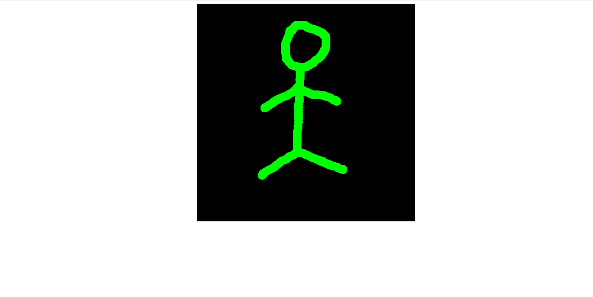

## Introduction

This is a project that uses websockets to create a drawing on a page and copy this drawing to another page instantly.
 
If you've never heard of websockets before, here's the main idea:

1. You send data from your browser to a server using a "socket" which is a real-time connection that can send data back and forth.

2. There is another computer that is connected to the server and will receive the data from it also using a socket.

In this project we will be using the same computer, however, we will open multiple tabs in the browser all on the same localhost where the server will be listening.


## Stack

To create the drawing I used the [p5.js](https://p5js.org/) library, express for the server, and the [socket.io](https://socket.io/) library which handles the websockets. Node will host the p5 sketch as a static file (this topic won't be covered here).

You can find this project on [GitHub](https://github.com/AhmadHamze/pictionary), here you can find the complete code.<br>
I recommend that you take a look if you're not familiar with node and express, I won't be covering these topics.
You can also find instructions on how to run the project locally on your computer. 

## Initialization

The first thing we need to do is to enable the use of websockets on the front-end. The easiest way to enable the websockets is to use the following cdn:

`
    <script
      src="https://cdn.socket.io/4.1.2/socket.io.min.js"
      integrity="sha384-toS6mmwu70G0fw54EGlWWeA4z3dyJ+dlXBtSURSKN4vyRFOcxd3Bzjj/AoOwY+Rg"
      crossorigin="anonymous"></script>
`

It's added within the head tag of the main html file (the file hosting the p5 sketch).

The next step is to create a websocket and to connect it to the port where the backend will be listening (this will be done shortly).

This is the code doing so, it's found in *sketch.js*:

```javascript
let socket;

function setup() {
  /* sketch code */
  socket = io.connect("http://localhost:5000");
}
```

> *The setup function is specific to the p5 library check the [documentation](https://p5js.org/reference/#/p5/setup) for more information*

## Drawing and sending the sketch to the back-end

Now, we want a function to draw a sketch using the mouse and we want to send this drawing to the back-end in order to send it back to the front-end again.

Fundamentally a drawing is a bunch of disks each having an x,y coordinate on the sketch. These coordinates are the data that should be sent using the sockets.

The following function "pen" takes care of this, it allows drawing using the mouse and sends the data (the (x,y) coordinates) to the back-end.

> Notice this line `socket.emit("coordinates", data);` the data are sent under the name of "coordinates" this will be useful when receiving the data in the back-end.

```javascript
    function pen() {
        noStroke();
        if (mouseIsPressed) {
            fill(0, 0, 255);
            ellipse(mouseX, mouseY, 20, 20);

            const data = {
            x: mouseX,
            y: mouseY,
            };
            // Sending the data under the name "coordinates"
            socket.emit("coordinates", data);
        }
    }
```

## Receiving the data in the back-end and sending it back to the front-end

We need to establish a connection and "grab" the data coming from the front-end.<br>
Remember that the data are emitted by the socket under the name "coordinates", so to grab them we will use
`
    socket.on("coordinates", (data) => {...})
`

within the call-back we will send back the data to the front-end again but not to the same client that sent it originally, we don't want to redraw the same sketch onto the same client.<br>
We will use the "broadcast" flag, it sets a modifier for the emission which makes sure the data will only be broadcasted to every socket but the sender.

Here is the complete code for receiving and sending back data.

> Notice that we are sending back the data under the same name "coordinates".

```javascript
const io = socket(server);

io.sockets.on("connection", (socket) => {
  console.log(`new connection: ${socket.id}`);
  // Receiving the data from the front-end
  socket.on("coordinates", (data) => {
    console.log(data);
    // Sending back the coordinates to the client, notice this way the
    // client sending the coordinates will not receive back what it already sent.
    socket.broadcast.emit("coordinates", data);
  });
});
```

## Receiving the data from the back-end and drawing a new sketch

This is the final stage, we will create a new function that draws a new sketch using the data received from the backend (the (x,y) coordinates).

To do so we will listen to the incoming event emitted from the back-end, we will add the listener to the "setup" function, here is the final version:

```javascript

    function setup() {
        const canvas = createCanvas(500, 500);
        canvas.parent("container");
        background(0);
        socket = io.connect("http://localhost:5000");
        // the socket receiving data from the back-end
        socket.on("coordinates", newDrawing);
    }
```

The "newDrawing" argument is a function that we will define, it draws the new sketch with a different color.

```javascript

    function newDrawing(data) {
        noStroke();
        fill(0, 255, 0);
        ellipse(data.x, data.y, 20, 20);
    }
```

## Result

That's it all is done, run the server and open two or more tabs on `http://localhost:5000`, draw anything on a canvas (it will be blue), you will see the same drawing on the other canvases with a different color (green).

The initial drawing


The drawing made by the websocket


