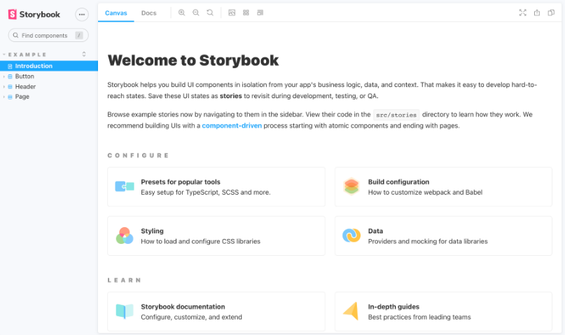
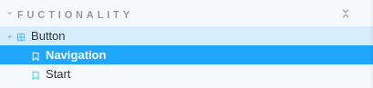
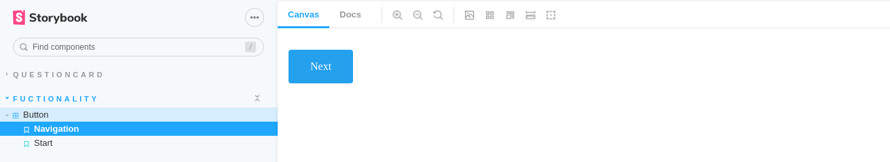
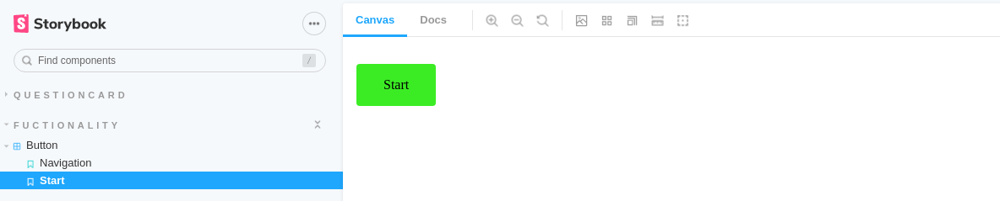
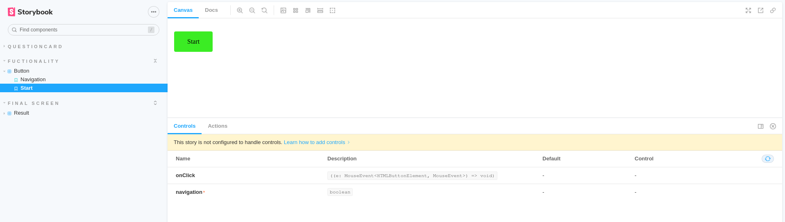
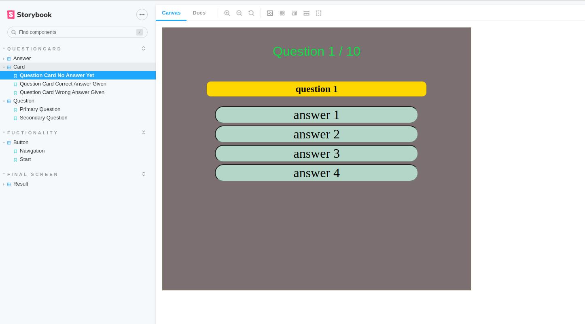
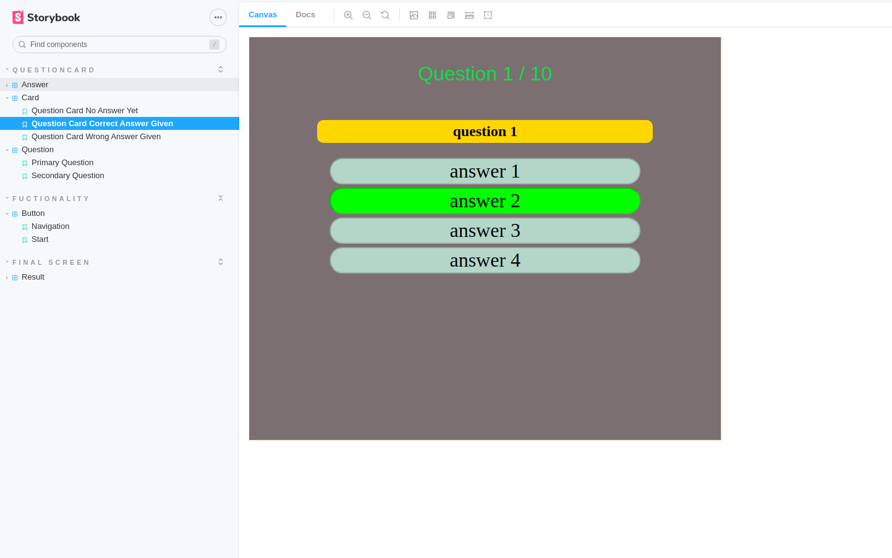
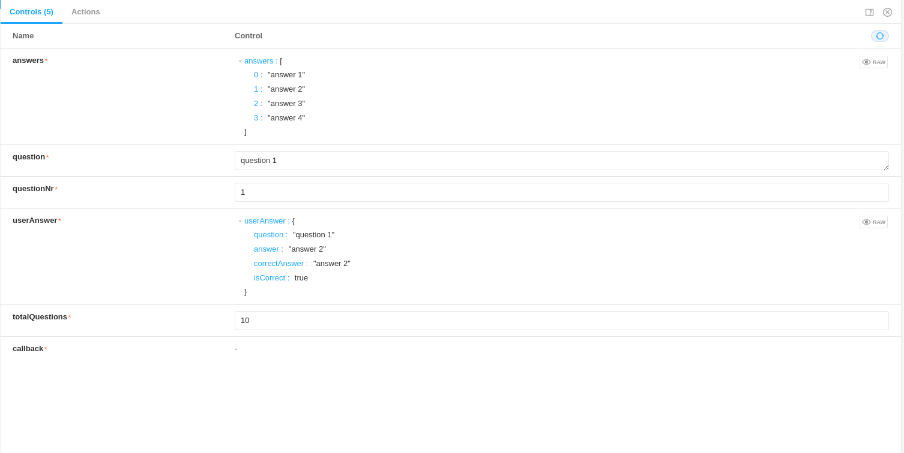
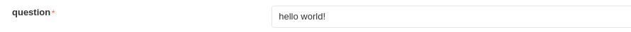
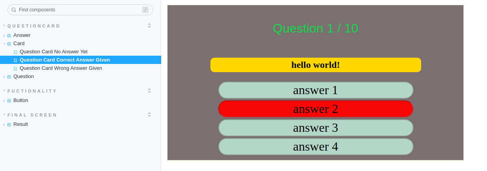

In this blog, I will be showing how to use [Storybook](https://storybook.js.org/) with React and talk a bit about its benefits.

I have used Storybook during my first job as a frontend developer, and I enjoyed every moment of it.

# What is Storybook

Here's a description from the official website

> Storybook is an open source tool for building UI components and pages in isolation. It streamlines UI development, testing, and documentation.

Couldn't say it better myself!

A storybook book is a collection of stories, think of a story as being the different representations of a certain component.<br>
For example, a header component could have a story that showcases the header in light mode and in dark mode, we will see an example soon!

Keep in mind that as a frontend developer you should create a story for every UI component that you create in your React application.


## Installation

To install Storybook, you can use Yarn or npm (`yarn install storybook`), a "stories" folder will be added into the "src" folder, it contains some boilerplate stories which you can explore.

To start Storybook run `yarn run storybook`.



However, if you're using React you might get an error with a message mentioning conflicting babel-loader versions.<br>
This is a known issue, to solve it just add the following lines in the package.json file

```json
  "resolutions": {
    "babel-loader": "8.1.0"
  }
```

## Creating Stories

To showcase Storybook, I will be using a React trivia quiz project, you can find it on [Github](https://github.com/AhmadHamze/Trivia-Quizz-React), there is also a [blog](https://ahmadhamze.github.io/posts/react/trivia-quiz/) explaining some of the code.

Let's start with creating the most basic story.

### A Basic Story

In the trivia quiz project, I created a **Button** component, this component has a _navigation_ prop which is a boolean.

This prop controls the _className_ of **Button**, in case _navigation_ is true, the background color of the button will be blue, otherwise, it will be green.

We can say that this component has two states, depending on the value of the boolean _navigation_, we want a story that showcases both states, let's see how to do it.

Create a **Button.stories.tsx** file (use the _js_ extension if you're not using Typescript), containing this code.

```typescript
import { Button } from "./Button";

export default {
  title: "Fuctionality/Button",
  component: Button,
};

export const Navigation = () => <Button navigation={true}>Next</Button>;
export const Start = () => <Button navigation={false}>Start</Button>;
```

This format is called "component story", it has a default export and one or more named exports (in this case it has two).

The _Button_ story is comprised of _Navigation_ and _Start_ building. Building each component story is quite simple, just call the React component with the needed prop.

The `title` property inside the default export is mandatory, also, it should be unique. This is the text you see in the left navigation panel in Storybook.<br>



As you can see, both stories that we created are present in the navigation bar, you can click on each one to see the component.

Here is the _Navigation_ story



and the _Start_ story



This is great, but it barely scratches the surface of what Storybook can do.

If you look at the bottom of the page, you will see a panel with a message saying "This story is not configured to handle controls. Learn how to add controls".



Controls literally allows you to control your stories, here's how to add them

### Controls

Let's see how to build controls on a new component, **QuestionCard**.

Just like before, we need a file **QuestionCard.stories.tsx**, we begin by the default export

```typescript
import { Story, Meta } from "@storybook/react/types-6-0";
import { QuestionCard, QuestionCardProps } from "./QuestionCard";

export default {
  title: "QuestionCard/Card",
  component: QuestionCard,
} as Meta;
```
> Notice that **QuestionCardProps** are imported as well, I suggest taking a look at the React component **QuestionCard** to better understand what's going on, especially how it's built using different components.

We will be using a feature added in version 6, that is arguments, it allows the sending of arguments to a story,
the props of a component are considered arguments.

The first thing we need to do is to create a template

```typescript
const Template: Story<QuestionCardProps> = (args) => <QuestionCard {...args} />;
```

Then, we need to bind this template to the story before sending the arguments to the story.

```typescript
export const QuestionCardNoAnswerYet = Template.bind({});

QuestionCardNoAnswerYet.args = {
  answers: ["answer 1", "answer 2", "answer 3", "answer 4"],
  question: "question 1",
  questionNr: 1,
  userAnswer: undefined,
  totalQuestions: 10,
};
```

The _Card_ story now has a state called **QuestionCardNoAnswerYet**, the argument `userAnswer: undefined` mimics the state of the component before the user chooses an answer.

Here is how this state of the story looks like



Similarly, we can create a state that mimics the component when the user gives the correct answer.

```typescript
export const QuestionCardCorrectAnswerGiven = Template.bind({});
QuestionCardCorrectAnswerGiven.args = {
  answers: ["answer 1", "answer 2", "answer 3", "answer 4"],
  question: "question 1",
  questionNr: 1,
  userAnswer: {
    question: "question 1",
    answer: "answer 2",
    correctAnswer: "answer 2",
    isCorrect: true,
  },
  totalQuestions: 10,
};
```

The **QuestionCardCorrectAnswerGiven** has the argument

```typescript
 userAnswer: {
    question: "question 1",
    answer: "answer 2",
    correctAnswer: "answer 2",
    isCorrect: true,
  }
```

Pay attention to `isCorrect: true`, this is what is going to make the difference between a correct answer and an incorrect one.



Now, the best part!

Take a look at the controls panel



Not only you can see the arguments given to the current state, but you can edit them.

I will change  `userAnswer.isCorrect` to `false`


and the main question to `hello world!`



You can see the effects of these changes immediately on the story



This is how powerful Storybook is, it allows you to edit your components in an isolated space allowing different ways to test them.<br>

### Final Words

This is a glimpse of the capabilities of Storybook, there is much more you can do with it.

The storybook can be exported into different formats and sent to the client or the business manager for feedback, they can do some changes themselves which strengthens the trust between the client and the team.

