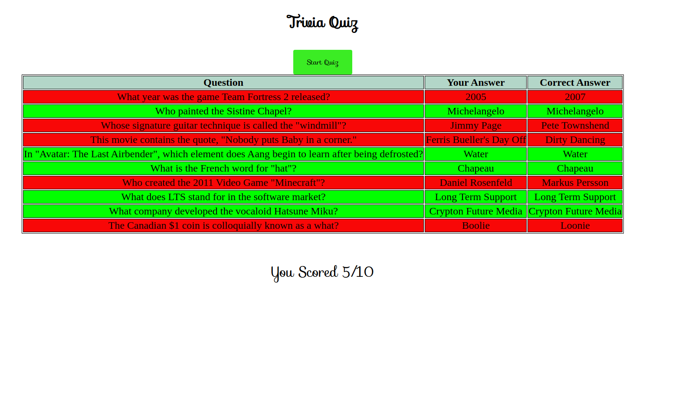

This is a simple React + TypeScript + Storybook application, it's a trivia quiz where the user answers a question and when all the questions are finished, they can see their score and the correct answers.

In this blog, I will go over the most important parts of the code, which you can find [here](https:github.com/AhmadHamze/Trivia-Quizz-React).

## Handling the data received from the API

The code is in `api/quizz-api.ts`.

The first thing to do is to create a type that handles the response returned by the API.<br>
The **Question** type mirrors the JSON object retrieved from the API

```typescript
export type Question = {
    category: string;
    correct_answer: string;
    difficult: string;
    incorrect_answers: string[];
    question: string;
    type: string;
}
```
The data returned by the API separates the correct answer from the incorrect ones,
we want a type where all answers exist in the same array, so we can shuffle it (otherwise the answer will always be at the same place!) and return it to the user.

To do so we can use [Intersection types](https://www.typescripttutorial.net/typescript-tutorial/typescript-intersection-types/) to create a new type containing a new array of strings (_answers_) holding
the answers in the way we want it.

```typescript
export type QuestionExtended = Question & {answers: string[]};
```

To shuffle an array you can use this function

```typescript
export function shuffleArray(array: any[]) {
    return [...array].sort(() => Math.random() - 0.5);
}
```

Now, for the function that fetches the data, and returns it in a shuffled manner

```typescript
export async function getQuizzData(): Promise<QuestionExtended[]> {
    const url = 'https://opentdb.com/api.php?amount=10&difficulty=easy&type=multiple';
    const response = await fetch(url);
    const data = await response.json();
    return data.results.map((question: Question) => ({
        ...question,
        answers: shuffleArray([...question.incorrect_answers, question.correct_answer]),
    }));
};
```

`getQuizzData()` maps each element of the data returned (a **Question** object) into a new object having
the same properties as the original but with a new property, _answers_, where we have all the shuffled answers to a question.

## Components

Here is the list of components used in the app

1. **Button** is just a normal HTML button styled using Button.css.
2. **Question** is the component that displays the question received from the API.
3. **Answer** is where a single answer will be displayed.
4. **QuestionCard** combines both components _Question_ and _Answer_ to create the question card that the user sees.
5. **Result** is a table showing how the user's answers alongside the correct ones and the score.

Let's take a look at a few components

### Answer

This is the interface for the props used by the component:

```typescript
export interface AnswerProps {
  children: React.ReactNode;
  disabled?: boolean;
  onClick?: (e: React.MouseEvent<HTMLButtonElement>) => void;
  state?: "neutral" | "correct" | "false";
  value?: string;
}
```

Notice the **state** prop, it's making sure that a state can only be one of the following "neutral", "correct", or "false" (it can also be undefined).

This prop is used to specify the background color of the answer based on whether the user answered correctly or not.

Take a look at the "answers.css" file, you will find three css classes named just like each of the three possible states.<br>
The **Answer** component is built this way:

```typescript
export const Answer: React.FC<AnswerProps> = ({
  children,
  state = "neutral",
  ...props
}) => {
  return (
    <button className={["answer", "size", state].join(" ")} {...props}>
      {children}
    </button>
  );
};
```

Pay attention to the _className_ attribute inside the button tag, it's a string built by combining three css classes, one of which is the _state_ which starts as "neutral", this is when the user hasn't answered yet.


If the answer given is correct, the answer's background becomes green


Red if it's incorrect


### QuestionCard

First, define the type of an answer given by the user

```typescript
export type AnswerType = {
  answer: string;
  correctAnswer: string;
  isCorrect: boolean;
  question: string;
};
```

This type is key in being able to figure out if the user answered correctly or not, it's also used to show the answers alongside the correct ones at the end of the quiz.

Now, let's take a look at the props

```typescript
export type QuestionCardProps = {
  answers: string[];
  callback: (e: React.MouseEvent<HTMLButtonElement>) => void;
  question: string;
  questionNr: number;
  userAnswer: AnswerType | undefined;
  totalQuestions: number;
};
```

- _answers_ is where all the answers of each question are stored
- _callback_ is called when the user clicks an answer
- _question_ is the question
- _questionNr_ tracks the number of the current question
- _userAnswer_ is the answer provided by the user OR simply undefined in case the answer isn't provided yet
- _totalQuestions_ is the total number of questions fetched from the API (set manually)


As stated before, the **QuestionCard** component is formed of other components.<br>
For each _answer_ provided by the API, it returns a div containing an **Answer** component, each of which is clickable.


This is how the **Answer** component is called inside **QuestionCard**

```typescript
          <Answer
            state={
              userAnswer?.isCorrect === undefined
                ? "neutral"
                : userAnswer.answer === answer && userAnswer.isCorrect
                ? "correct"
                : userAnswer.answer === answer
                ? "false"
                : "neutral"
            }
            disabled={!!userAnswer}
            value={answer}
            onClick={callback}
          >
            <span dangerouslySetInnerHTML={{ __html: answer }} />
          </Answer>
```

The _state_ prop is evaluated based on if the given answer is correct.

Once an answer is given the user should no longer be able to answer again, hence the code `disabled={!!userAnswer}` (if the current question is not yet answered `!!userAnswer` will be `false`, otherwise it will be `true`).

> A wrong answer is given, the background turns red, and the "Next Question" button appears (more about that in the next segment) 


> The correct answer is given, the background turns green, and the "Next Question" button appears


## Main Application

The `App` function starts by defining a few states

```typescript
  const [loading, setLoading] = useState(false);
  const [number, setNumber] = useState(0);
  const [questions, setQuestions] = useState<QuestionExtended[]>([]);
  const [userAnswers, setUserAnswers] = useState<AnswerType[]>([]);
  const [score, setScore] = useState(0);
  const [gameOver, setGameOver] = useState(true);
```

- _loading_ is to wait for the promise returned by `getQuizzData` to be handled
- _number_ tracks the current question number
- _questions_ saves the extended questions
- _userAnswers_ saves all the user answers
- _score_ is the total score of the user
- _gameOver_ specifies if the game is over or not


Three functions handle the logic in the application:

1. startQuizz

Begin by setting _loading_ to `true` and _gameOver_ to `false`, set _questions_ to the
returned value of `getQuizzData`, set _score_ to zero, _userAnswers_ to an empty array, and _number_ to zero.
Finally set _loading_ to `false`.<br>
This function is called when the user clicks the start button, which will only be shown if _gameOver_ is `true`.

> This is the first thing seen by the user when launching the application


2. checkAnswer

This function checks if the answer clicked by the user is correct, it sets the score and saves the user answer
in the _userAnswers_ array.<br>
It is called in the _callback_ prop of the _QuestionCard_ component.

3. nextQuestion

Handles the navigation of the questions, it also sets _gameOver_ to `true` when the final question is reached.<br>
It is called just after the _QuestionCard_, in the **Button** component as the callback of the _onClick_ prop.<br>
Note that this component is displayed only if the _gameOver_ is `true`, _loading_ is `false`, and if the user has
answered the current question.

### The Result

After answering the last question, the "Show Result" button is displayed


Clicking the button shows the final screen



The correct answers are highlighted in green, the wrong answers in red.

You can start a new quiz by clicking "Start Quiz".
